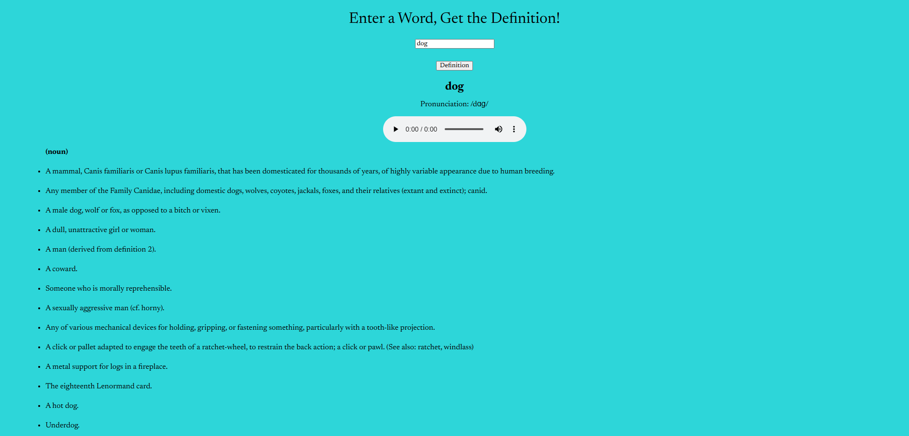

# Dictionary API

Link to project: (https://dynamicdictionary.netlify.app/)

## How It's Made:
Tech used: HTML, CSS, JS

A dictionary application that makes a fetch request to a dictionary API (https://dictionaryapi.dev/?ref=freepublicapis.com) and showcases the corresponding pronunciation, parts of speech, audio pronuncation, and definitions for the user inputted word. 

## Optimizations

Initially, upon fetching data from the API and displaying it on the DOM, the definitions for ALL parts of speech were being displayed in the same list. This version of the application has been updated to separate lists of definitions based on parts of speech.

## Lessons Learned

By building this application, I learned how to pull audio/mpeg files from the API and allow users to play a pronunciation audio file to go along with the word they typed in. I also learned to use the appendChild method to dynamically create a list of definitions from the data that the API returned.
